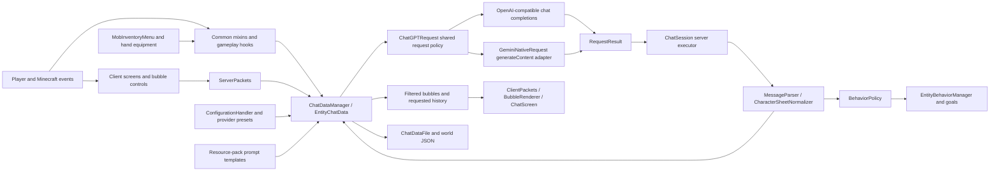
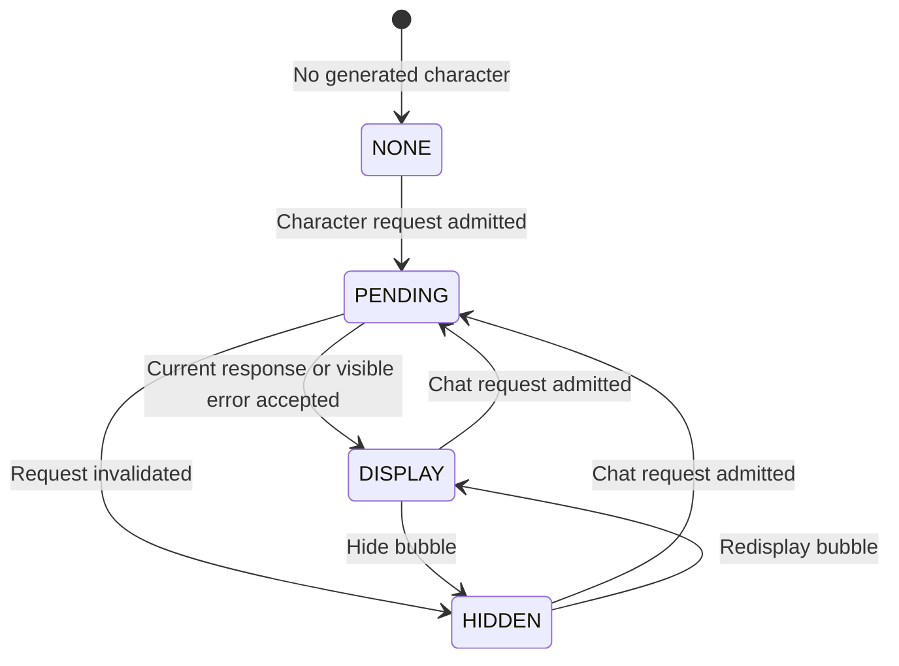

# MobChat architecture

This is the code map for the MobChat fork at [Le-Who/MobChat](https://github.com/Le-Who/MobChat). It describes local source and resources as of 2026-10-04. The default Minecraft target comes from [gradle.properties](gradle.properties); the code and asset namespace remains `creaturechat` for saved-world and packet compatibility. The former AI Villager trees are intentionally absent and their development is paused.

Use [README](README.md) for playing and administration, [INSTALL](INSTALL.md) for building, and [CONTRIBUTING](CONTRIBUTING.md) for changing the code. This document explains ownership, data flow, and constraints. It does not imply that every historical Minecraft target has been tested.

## 1. System map



The server owns configuration, conversations, memories, relationships, inventories, and AI actions. The client owns rendering, input, and its synchronized display state. HTTP work runs asynchronously; it cannot apply a response to a Minecraft world directly. `ChatSession` checks request ownership and transfers the complete result callback to the originating server executor.

The updater is a separate path: GitHub release metadata → matching jar/hash selection → verified staging → helper process → jar replacement after the current JVM exits. It does not use chat history or AI credentials.

## 2. Source ownership

Paths below are relative to the repository. The common Java root is `src/main/java/com/lewho/`; the client root is `src/client/java/com/lewho/`.

| Area | Main owners | Responsibility |
| --- | --- | --- |
| Registration | [ModInit](src/main/java/com/lewho/ModInit.java), [ClientInit](src/client/java/com/lewho/ClientInit.java) | Commands, menus, packets, particles, lifecycle events, client ticks and world rendering. |
| Configuration | [commands/](src/main/java/com/lewho/commands/) | World/root config precedence, typed settings, provider presets, sanitized setup DTO, languages, custom roles and commands. |
| Chat state | [ChatDataManager](src/main/java/com/lewho/chat/ChatDataManager.java), [EntityChatData](src/main/java/com/lewho/chat/EntityChatData.java), [PlayerData](src/main/java/com/lewho/chat/PlayerData.java) | NPC aggregate, per-player relationships, history, memories, generation and response effects. |
| Request policy | [ChatGPTRequest](src/main/java/com/lewho/chat/ChatGPTRequest.java), [GeminiNativeRequest](src/main/java/com/lewho/chat/GeminiNativeRequest.java), [ApiUsageLimiter](src/main/java/com/lewho/chat/ApiUsageLimiter.java) | Input snapshot, output contracts, quota reservation, bounded candidate traversal, HTTP errors, redaction and request-specific diagnostics. |
| Response parsing | [message/](src/main/java/com/lewho/message/), [json/](src/main/java/com/lewho/json/), [CharacterSheetNormalizer](src/main/java/com/lewho/chat/CharacterSheetNormalizer.java) | Structured JSON, limited salvage, legacy action tags and character-sheet normalization. |
| Social and automatic chat | [SocialEventRecorder](src/main/java/com/lewho/chat/SocialEventRecorder.java), [AutoMessageBucket](src/main/java/com/lewho/chat/AutoMessageBucket.java), [LivingEntityChatHooks](src/main/java/com/lewho/chat/LivingEntityChatHooks.java), [MobInteractionHooks](src/main/java/com/lewho/chat/MobInteractionHooks.java) | Central event accounting, interaction/damage policy, independent reactive and ambient throttles. |
| Response/save lifetime | [ChatSession](src/main/java/com/lewho/chat/ChatSession.java), [ChatDataAutoSaver](src/main/java/com/lewho/chat/ChatDataAutoSaver.java), [ChatDataSaverScheduler](src/main/java/com/lewho/chat/ChatDataSaverScheduler.java), [ChatDataFile](src/main/java/com/lewho/chat/ChatDataFile.java) | Active-session admission, late-result rejection, server-owned snapshots and replacement of the saved file. |
| Entity actions | [BehaviorPolicy](src/main/java/com/lewho/chat/BehaviorPolicy.java), [goals/](src/main/java/com/lewho/goals/), [controls/](src/main/java/com/lewho/controls/) | Action arbitration, goal installation/removal, movement, looking and damage adapters. |
| Inventory | [inventory/](src/main/java/com/lewho/inventory/), [items/](src/main/java/com/lewho/items/) | Mob container and menu, permission-aware transfers, equipment mirrors, biome loot, item categorization for generated loot. |
| Minecraft integration | [mixin/](src/main/java/com/lewho/mixin/), [utils/](src/main/java/com/lewho/utils/) | Entity NBT/UUID, native inventories, chat interception, protected accessors and narrow API helpers. |
| Network | [ServerPackets](src/main/java/com/lewho/network/ServerPackets.java), [ClientPackets](src/client/java/com/lewho/network/ClientPackets.java), common/client packet helpers | Server/client protocol, filtered current messages, history on demand, setup screen and player chat status. |
| Client interface | [ui/](src/client/java/com/lewho/ui/), [client inventory/](src/client/java/com/lewho/inventory/) | Bubbles, hit regions, paging, chat input/history, inventory, configuration and locale picker. |
| Client visuals | [render/](src/client/java/com/lewho/render/), [skin/](src/client/java/com/lewho/skin/), [client mixins/](src/client/java/com/lewho/mixin/client/), [particle/](src/client/java/com/lewho/particle/) | Rendering API adapters, entity icons, skin icon extraction and particle factories. |
| Text and particles | [i18n/](src/main/java/com/lewho/i18n/), [common particle/](src/main/java/com/lewho/particle/) | Translation fallbacks, text components, particle registration and emission. |
| Updates | [common update/](src/main/java/com/lewho/update/), [client update/](src/client/java/com/lewho/update/) | Runtime jar discovery, GitHub release parsing, staging/hash verification, helper installation and consent UI. |
| Resource generation | [datagen/](src/main/java/com/lewho/datagen/), [generate_roles.py](generate_roles.py) | Loot, advancements and language generation; separate local role-data tool. |
| Version adaptations | [src/vs/](src/vs/), [build.gradle](build.gradle) | Cumulative whole-class replacements for Minecraft API changes. |
| Verification | [src/test/java/](src/test/java/) | JUnit domain, parser, HTTP, persistence, inventory and updater regressions; optional live-provider behavior tests. |

`.agents/`, `skills-lock.json` and `docs/superpowers/` are agent tooling and audit planning material. They are not Minecraft runtime modules.

## 3. Persisted domain model

`ChatDataManager` holds a UUID-keyed map of NPC `EntityChatData`. A concurrent outer map does not make the mutable contents thread-safe: histories, player maps, memories and flags belong to the server thread.

| Object | Meaning and lifetime |
| --- | --- |
| `EntityChatData` | One NPC's character sheet, visible message/status/page, shared message history, mood, memories, home and per-player state. Persisted in world chat JSON. |
| `PlayerData` | One player's relationship with one NPC. UUID is the durable key; display names support legacy migration. Stores friendship, social reputation/events, counters, advancement flags and damage-reaction state. |
| `ChatMessage` | Provider history entry with role, content and optional player display name. The same NPC history is used across its players. |
| `ChatHistoryEntry` | Spoken-history projection for the chat screen; hides internal context-switch notes. History requests cap the recent entries and individual text lengths. |
| `MemoryEntry` / `MemoryType` | Typed bounded NPC memory. Current policy caps entries at 20 and text at 180 characters, deduplicating case-insensitively. Legacy `memories` text is maintained alongside the typed representation. |
| `EntityChatDataLight` | Per-viewer current-message sync projection, with relationship/display state. It excludes full history and the character sheet. |
| `PlayerChatPreferences` | Per-player overhearing preference in a separate world file. It controls current bubble and normal-chat display. |
| `ChatSession.Request` | Transient ownership of one in-flight request for an NPC. Not serialized. Rejects overlapping admission and stale completion. |
| `RequestResult` | Immutable content and diagnostics from one HTTP operation. Legacy static `last*` fields remain compatibility diagnostics; gameplay uses the result belonging to its own request. |

Friendship is an absolute integer in `[-3, 3]`. An AI action setting friendship to `2` sets the resulting value to `2`; it does not add two points. Positive friendship prevents an attack against that player through the applicable policy/target guard.

Relationships are player-specific, but the NPC's character, memories and conversation history are shared. `/creaturechat overhear off` is a display preference, not separate private storage. Opening the chat screen requests recent shared history for that NPC. The full history is not broadcast during login.

Entity/bucket mixins preserve a `CCUUID` bridge when Minecraft assigns a new entity UUID. `ChatDataManager.updateUUID` moves the aggregate and invalidates request ownership. Newer Creaking support also maps puppet identities; its cache is separate from the main persisted chat file.

## 4. A direct conversation

```mermaid
sequenceDiagram
    participant C as ChatScreen / bubble click
    participant S as ServerPackets
    participant D as EntityChatData
    participant Q as ChatSession
    participant H as ChatGPTRequest
    participant A as AI endpoint
    C->>S: Chat or greeting packet
    S->>S: Execute on server; resolve player and entity
    S->>Q: Admit current NPC request
    Q-->>S: Request token, or reject busy/stale request
    S->>S: Apply allowed reaction quota/cooldown policy
    S->>D: Generate character or chat with admitted token
    D->>D: Record admitted input and build prompt/context
    D->>H: Snapshot config, context and history
    H->>H: Reserve quota and select key/model candidate
    H->>A: Structured character/chat HTTP request
    A-->>H: Provider response or error
    H-->>Q: RequestResult completion
    Q->>S: Queue whole callback on originating server
    S->>Q: Recheck session, state, player, world and entity
    Q->>D: Apply current result, or discard
    D->>D: Parse; update state; arbitrate actions
    D-->>C: Current message and permitted display effects
```

For a mob without a character sheet, the initial direct request creates its character rather than preserving the typed input as the first normal conversation. Character generation also initializes biome loot when the container is empty; chested-horse items are migrated into the custom inventory first. Character JSON is normalized into the existing dash-list sheet format used by prompts and display.

`ChatPrompt` loads templates from Minecraft's resource manager, allowing datapack overrides. Prompt context includes the character, requesting player's relationship and language, selected world/player facts, recent social events, memories and configured story text. Generation language resolves from the server override or the player's client locale.

Normal replies pass through `MessageParser`, then update mood/memory and call `BehaviorPolicy` before goals or friendship effects are applied. The server broadcasts the resulting current message. Successful direct replies can trigger one nearby mob-to-mob response wave; the secondary response disables another cascade.

### Response state and cancellation



The request token, rather than `PENDING` alone, owns the in-flight operation. Admission precedes automatic buckets, manual cooldown resets, TALK installation and character loot preparation. A busy or stale request changes none of these scheduling effects; independent social events are still recorded. Policy denial or preparation failure releases the admitted token, and ambient dispatch reports whether a request was actually admitted. A response is current only while its session, aggregate, world, mob and connected player identities remain current. A late result after unloading, moving worlds, replacing state or stopping the server cannot act on a replacement world. Discarding a current pending request also clears its automatic-generation marker so a later broadcast cannot set it back to `PENDING`. Persisted unfinished requests are normalized when loading; no HTTP request survives a server restart.

The autosave timer schedules work on the owning server. Snapshot serialization and save ordering happen there. Shutdown closes the response session and stops scheduled saves before writing the final state and clearing the map. `ChatDataFile` serializes a complete UTF-8 snapshot before replacing the previous JSON, using atomic replacement where supported and a replace fallback otherwise. A serialization failure preserves the previous good file.

## 5. Provider contracts and request policy

`ChatGPTRequest.StructuredOutputMode` is the transport contract:

| Mode | Output | Effective minimum budget |
| --- | --- | --- |
| `NONE` | Plain text, used by the configuration connectivity test. | Configured budget. |
| `CHAT` | JSON `message`, `mood`, `memory_updates`, `actions` with typed action/value pairs. | 1024 tokens; medium/high thinking raises this to 1536/2048. |
| `CHARACTER` | JSON name, personality, speaking style, class, skills, likes/dislikes, alignment, background and short greeting. | 1536 tokens; medium/high thinking raises this to 2048/3072. |

The compatible adapter uses chat-completions messages and strict `response_format` JSON schemas. The native adapter uses `systemInstruction`, `contents`, `generationConfig.responseMimeType` and `generationConfig.responseSchema`, omitting schema features the native adapter does not send. A Google URL without the `/openai` segment selects native `generateContent`; other configured URLs use the compatible shape. Presets are in [ConfigurationPresets](src/main/java/com/lewho/commands/ConfigurationPresets.java).

Both adapters share orchestration: immutable request inputs, context-budget selection, quota preflight before each actual HTTP attempt, model-first traversal of configured key/model pairs, bounded transient retry, permanent-error handling, and secret redaction before logging or reporting errors. Native payload/envelope differences remain in `GeminiNativeRequest`. An explicit native URL containing a model is updated when model fallback selects another model.

`ApiUsageLimiter` applies local Gemini limits with defaults of 14 requests/minute and 450 requests/day. `per_key` hashes each key into a separate key/model bucket; `shared` shares a bucket across keys for each model. Different models still have separate buckets. Daily counts persist beside the effective configuration in `creaturechat_usage.json` and reset on the limiter's Los Angeles day boundary. Minute windows and temporary provider blocks are runtime state. Local limits do not override provider limits: HTTP 429 handling remains necessary.

Malformed JSON is handled conservatively. The parser accepts structured replies wrapped in fences/preambles, and may salvage a complete spoken message and mood from truncation. It does not execute incomplete actions or memory changes from salvaged JSON. Legacy tag parsing remains for old responses; new generation still requests schemas. Character normalization accepts legacy sheets for saved-data compatibility.

## 6. Events, rate limits and actions

Automatic LLM calls have several independent gates; changing one does not disable all others:

| Trigger | State/policy owner |
| --- | --- |
| Manual chat | Current-session admission, direct chat flow; resets the player's reactive allowance and damage-reaction cycle. |
| Damage | `LivingEntityChatHooks` records every social hit; the per-NPC/player damage cooldown suppresses repeated replies and summarizes suppressed hits in the next allowed reaction. |
| Item showing/giving and inventory closing | `MobInteractionHooks` / `MobInventoryMenu` record social events, then use the ordinary reactive automatic-message path. |
| Nearby public player chat | `ServerPackets.handleNearbyPlayerChat`, proximity/character checks, player and target ambient buckets, ambient action policy. |
| Nearby mob reply | Source and target ambient buckets, rumor memory, one-wave recursion guard and ambient action policy. |
| All Gemini requests, including manual requests | `ApiUsageLimiter` preflight plus provider error handling. |

`AutoMessageBucket` clamps capacity/cooldown to positive minimums; a zero value is not an off switch. A social event can be recorded even when its LLM reaction is suppressed. Call `SocialEventRecorder` for this accounting instead of editing summary strings at event sites.

Ambient replies may update text, mood and memories, but `BehaviorPolicy` blocks their action list, including friendship changes. Direct actions are processed in response order. An updated friendship value affects whether a subsequent ATTACK is allowed. Creating the first home requires friendship 3; an existing home permits return/guard at lower friendship, provided the home belongs to the current dimension.

| Goal group | Priority | Behavior |
| --- | --- | --- |
| TALK, PROTECT | 2 | Temporary conversation movement/look control; target the protected entity's attacker. |
| FOLLOW, FLEE, ATTACK, LEAD | 3 | Follow/teleport policy, flee target, native/fallback attack, or a sequence of reachable waypoints. |
| WAIT, RETURN_HOME, GUARD_HOME | 4 | Hold a location, return within the home radius, or remain around home. |

`EntityBehaviorManager` owns goal-selector mutation and deduplication. `GoalUtils` accesses selectors through the checked accessor mixin. `LookControls`/`SpeedControls` handle creatures whose movement differs from ordinary pathfinding mobs; `DamageHelper` isolates hurt API differences. Goals themselves are not serialized. The persisted `guardingHome` flag does not reconstruct a live goal after a restart. `GuardHomeGoal` keeps the mob in an area; it does not independently search for enemies.

## 7. Inventories and Minecraft hooks

`MobInventoryMenu` has 15 mob slots arranged as three rows of five. Main/offhand equipment is mirrored in slots 10/11. Ordinary inventory access requires positive friendship; hand access requires friendship 3. Shift-right-click opens supported mob inventories; the riding inventory key uses its own eligible-mob and friendship checks.

`MobHandSlot` maintains equal container/equipment counts after `set`, in-place `setChanged` and `onTake`, using copies to avoid aliasing. Vanilla quick-move can mutate an occupied stack without calling `set`, so synchronizing only `set`/`onTake` is insufficient. Closing the menu compares starting/current items, accounts separately for disarmed equipment, records gifts/theft, updates advancements and builds the automatic reaction text. Item totals are currently grouped by `Item`; this is not a component-level transaction ledger.

`MobInventoryTransferMenu` applies the slot placement predicate to occupied-stack merges as well as empty destinations, preserving vanilla merge-before-insert and forward/reverse ordering. Without this boundary, shift-clicking can insert matching items into an occupied locked slot. Advancement API overrides use the same UUID/legacy player lookup and social event accounting as base.

The common mixins are Minecraft API adapters. `LivingEntityChatHooks` and `MobInteractionHooks` contain shared friendship, UUID, social and damage policy, allowing later whole-class overrides to retain the same behavior. Other hooks preserve entity identity and containers, redirect Allay/Piglin/Pillager/Villager native inventory use, and keep characterized Vex/Wandering Trader mobs from their ordinary timed disappearance. The Creaking hook is meaningful only in newer targets.

Keep Minecraft-specific injection signatures and serialization in the version adapter. Shared gameplay rules belong outside the mixin package. The mixin JSON files are required and use a nonzero default injection requirement: a target-method change can prevent the mod from loading, even if Java compiles.

## 8. Client interface and protocol

`BubbleRenderer` draws world-space pages, relationship borders, icons and controls, using per-type visibility rules and client geometry caches. `BubbleLocationManager` stores clickable quad regions; `ClickHandler` intersects the player's view with these regions. A greeting starts generation, the page controls navigate three-line pages, the last-page action opens `ChatScreen`, and the top control hides the bubble.

`ChatScreen` asks for the selected mob's recent history and tracks open/closed chat status on the server. The edit box accepts up to 512 characters; sending closes the screen. `PlayerMessageManager` maintains transient player messages and tick-based display lifetime. `InventoryKeyHandler` handles the eligible riding-inventory path.

`CreatureChatConfigScreen` operates on `ConfigurationScreenData`, a sanitized DTO. Stored full keys stay server-side; a blank key field preserves them. Server handlers recheck OP permission before saving/testing. `LanguageSelectorScreen` uses the official Minecraft locale list from `MinecraftLanguages`; this list is separate from the mod's own translated UI locale files.

Server packets send current state to connected viewers allowed by their display preferences, and serve shared history on request. The current-message broadcast has no distance/dimension filter. History is looked up by NPC UUID with a cap of 60 recent entries and 4096 characters per entry; it is not protected by a proximity or per-player-history boundary. Login state is compressed and split into chunks of up to 32,000 bytes. Common/client buffer and packet helpers isolate networking API differences; >=1.20.5 overrides use payload codecs. Most client state is applied through the client executor.

Custom entity icons mirror renderer texture paths under the `creaturechat` asset namespace and use 32×32 PNGs. `SkinUtils` detects the exact skin marker pixels and assembles the 24×24 player icon from UV tiles; client skin mixins cache the image. `BlendHelper`, `QuadBuffer`, `ShaderHelper`, `EntityTextureHelper`, `EntityRenderPosition`, `TickDelta`, `TextureLoader` and screen/menu helpers isolate rendering API changes. See [ICONS](ICONS.md) for asset instructions.

## 9. Configuration, files and resource generation

`ConfigurationHandler` loads the world-specific `creaturechat.json` when present, otherwise the process-root default, otherwise built-in defaults. `/creaturechat setup` and its subcommands save the world configuration. Many older setting commands support explicit `--config server` / `--config default` and default to the root file; check their registered command tree before assuming a scope.

| File/location | Owner and contents |
| --- | --- |
| World root `creaturechat.json`, or process root fallback | Provider credentials, endpoint/models, story, language, output/thinking/timeouts, throttles and visibility settings. |
| World root `chatdata.json` | Serialized NPC map: shared history, sheets, memories and per-player state. |
| World root `creaturechat_player_prefs.json` | Per-player overhearing display preference. |
| `creaturechat_usage.json` beside effective config | Hashed Gemini usage buckets and daily counts; ignored by Git. |
| World root or process root `custom_roles.json` | Additional character roles consumed by `CustomRoleHandler`. |
| Game root `.creaturechat-updates/` | Download staging, pending manifest, helper and backups; ignored by Git. |
| `src/main/generated/` | Ignored datagen output, included in resources when present; regenerated from scratch by `runDatagen`. |
| `build/`, `.gradle/`, development `run/` | Build caches, artifacts and development runtime files. |

The resource tree includes three prompt templates (`system-chat`, `system-character`, and an unused quest template), 30 advancements, 14 biome/catch-all loot tables, 18 translated UI locales, particles, icons/UI textures and example screenshots. Advancements use impossible triggers and are awarded from code. English fallback text also lives in Java translation calls; there is no tracked `en_us.json` baseline.

`CreatureChatDataGenerator` registers loot, advancement and language providers. `runDatagen` is a separate explicit task: it clears `src/main/generated`, then generates resources. `LangSync` can also modify tracked translations by adding fallback keys/removing obsolete keys. Ordinary `build` does not invoke datagen. `generate_roles.py` writes a different path than the runtime custom-role loader; move its output to the runtime location explicitly as described in [CONTRIBUTING](CONTRIBUTING.md).

## 10. Updater lifetime

`UpdateRuntime` detects the game directory, Minecraft/mod version, installed jar and Java executable. `ModJarLocator` prefers the jar actually installed in `mods/`, which avoids treating a Connector-transformed cache copy as the install target.

`GitHubReleaseClient` fetches releases for `Le-Who/MobChat`; `GitHubReleaseSelector` ignores draft/prerelease entries, selects the exact Minecraft jar suffix, requires the matching `.jar.sha512`, and compares the mod version. `UpdateStager` verifies SHA-512 before writing the staged jar and pending manifest. The hash checks that the jar matches its release asset pair.

The server `update download` command stages only. `update apply` stages/reuses a candidate and launches `UpdateHelperLauncher`. Client consent combines download, staging and helper launch. The launcher copies the standalone `CreatureChatUpdateHelper` class and starts a Java process; the helper waits for the current PID to exit, verifies the file again, backs up the installed jar and replaces it. If moving the staged jar fails, it attempts to restore the backup; restoration can itself fail and then require manual recovery. It does not restart the JVM. The new mod version takes effect on the next Minecraft/server launch.

## 11. Build and version map

The wrapper uses Gradle 8.14.3 and `build.gradle` pins Loom 1.11.8. The configured compiler toolchain is JDK 26, with Java source/target/API release 17 and `-Werror`. Minecraft runtime Java requirements depend on the selected target. The local toolchain path is in `gradle.properties`, and automatic toolchain discovery/download is disabled. [INSTALL](INSTALL.md) documents changing that path.

The build applies every `src/vs/vX_Y_Z` folder whose version is <= the target, oldest first. A matching relative Java path replaces the whole earlier class; folders are cumulative, not independent full implementations. The base 1.20.1 target applies no overrides.

| First applicable folder | Principal adaptation families |
| --- | --- |
| `v1_20_2` | Advancement APIs, inventory screen and screen helpers. |
| `v1_20_3` | Advancement serialization and button helpers. |
| `v1_20_5` | Payload codecs, registry-aware item NBT, loot/datagen APIs, bucket components, menu opening and entity interaction adapters. |
| `v1_21_0` | Updated inventory/bucket/advancement APIs, Wither loot hook, particle/quad APIs and advancement background paths. |
| `v1_21_2` | `hurtServer`, Squid swim vectors, renderer/skin/icon access, shader and screen helpers. |
| `v1_21_4` | Creaking identity hook, skin download hook and particle API. |
| `v1_21_5` | Optional NBT access, UUID/owner formats, respawn configuration, armor/gossip, new rendering and click/hover/screen APIs. |
| `v1_21_6` | `ValueInput`/`ValueOutput` entity/inventory persistence and additional rendering/menu changes. |
| `v1_21_7` | Happy Ghast look-control adapter. |

`build` produces a remapped versioned jar, matching SHA-512 file, stable `creaturechat.jar` and source jar. Every root Markdown file is included in the main jar, including this map. Nested audit plans are not packaged. No release is uploaded by the ordinary build.

The historical `build.sh` matrix and `.gitlab-ci.yml` are separate legacy automation. They edit tracked build inputs, skip tests/access-widener checks in the matrix and do not establish current GitHub release automation. Their existence is not evidence of a passing newer-target build. See [INSTALL](INSTALL.md) for their exact limitations.

During the 2026-10-04 audit, `compileJava` passed for 1.21.7 with the matrix's loader/API dependencies. `compileClientJava` remains blocked by eight existing GUI API errors: the inventory tooltip call, chat scroll-handler signature, configuration/language/update screen background calls, and selection-list background flags. These require client version adapters before a complete 1.21.7 jar can be advertised. The default-target suite is separate: 195 tests across 40 suites, with zero failures/errors and 12 intentional live-provider skips in a fresh offline run.

## 12. Verification map

Tests under `src/test/java/` cover the following contracts:

| Area | Relevant suites |
| --- | --- |
| HTTP/output policy | `ChatGPTRequestStructuredOutputTests`, `ChatGPTRequestErrorTests`, `ChatGPTRequestUsageLimitTests`, `GeminiNativeRequestTests`, `GeminiNativePolicyTests`, `ConfigurationRotationTests`. |
| Quotas and automatic chat | `GeminiUsageLimiterTests`, `DamageReactionRateLimitTests`, `AmbientRateLimitTests`, `AmbientConfigurationTests`. |
| State and persistence | `ChatStateLifecycleTests`, `ChatRequestDispatchTests`, `ChatDataFileTests`, `EntityChatDataIdentityTests`, `EntityChatDataMetadataTests`, `EntityMemoryEntryTests`, `PlayerDataSocialTests`, `ChatHistoryEntryTests`. |
| Actions and hooks | `BehaviorPolicyTests`, `GameplayChatHooksTests`, `SocialEventRecorderTests`. |
| Inventories | `MobHandSlotTests`, `MobInventorySocialTests`, `com.lewho.inventory.MobInventoryAccessTests`. |
| Config/language | `ConfigurationRotationTests`, `ConfigurationScreenDataTests`, `AmbientConfigurationTests`, `PromptContractTests`. |
| Protocol/display preferences | `ServerPacketsSafetyTests`, `PlayerChatPreferencesTests`. |
| Updates | Release parsing/selection, versions, jar discovery, staging/install and client prompt policy suites. |

HTTP regression tests use loopback fixtures, synthetic keys and deterministic responses. Session tests use drained executors to prove deferred effects and invalidation. File tests use temporary directories and actual JSON. Inventory tests use real Minecraft stacks/containers. These are behavioral contracts, not a substitute for loading mixins and interacting with the client in a real game.

`BehaviorTests` requires an explicit `API_KEY` environment variable, calls a real AI endpoint and can write `src/test/BehaviorOutputs.json`. It is skipped for ordinary offline validation. Keep external-provider evaluations separate from repeatable tests. Final validation details belong in the audit result/release report, rather than treating this architecture map as a permanently current test log.

## 13. Remaining engineering work

These source-level concerns remain separate from the repairs in this audit. They are useful follow-up targets, with their own behavioral reproduction required before changing policy:

- `EntityBehaviorManager` priority shifting needs a regression for duplicate and sparse priorities; the current algorithm can move the wrong goals or compress unrelated priority gaps.
- `PlayerBaseGoal` only rebinds a dead target in its former world. Disconnection and cross-dimension respawn need explicit target-lifetime policy; `ProtectPlayerGoal` also retains its original protected entity reference.
- NPC history is shared and persisted without a total length cap, although provider context and UI history selection are bounded. A retention policy must preserve memory/relationship semantics and existing saves.
- Initial hand synchronization and close-menu item accounting need component-aware cases; same-type items with different NBT/components require more than aggregate `Item` counts. Menu lifetime also needs explicit alive/distance/dimension scenarios.
- Interaction hooks observe post-interaction held stacks. Consuming the last item requires a targeted test to define gift amount and event semantics.
- Client login chunk assembly and transient UI maps need disconnect/reset tests. Compressed input needs truncated-stream and no-progress handling before a malformed sync can stall decompression; character encoding should be explicit on both ends.
- Character normalization still accepts legacy plain sheets. Tightening this boundary needs tests distinguishing real legacy saves from unexpected provider text.
- Complete the client GUI adapters identified by the 1.21.7 compile check above. Then verify applicable intermediate targets and in-game mixin/network/render behavior; source delegation checks or a server-only compile cannot prove a complete newer runtime.
- The multi-version build/release scripts need isolated inputs, complete jar/hash pairs and reproducible CI before their matrix can be advertised as verified release support.

Keep these changes in their existing owners. Prefer narrow version helpers and shared rules over duplicating large classes or introducing a second state model.
