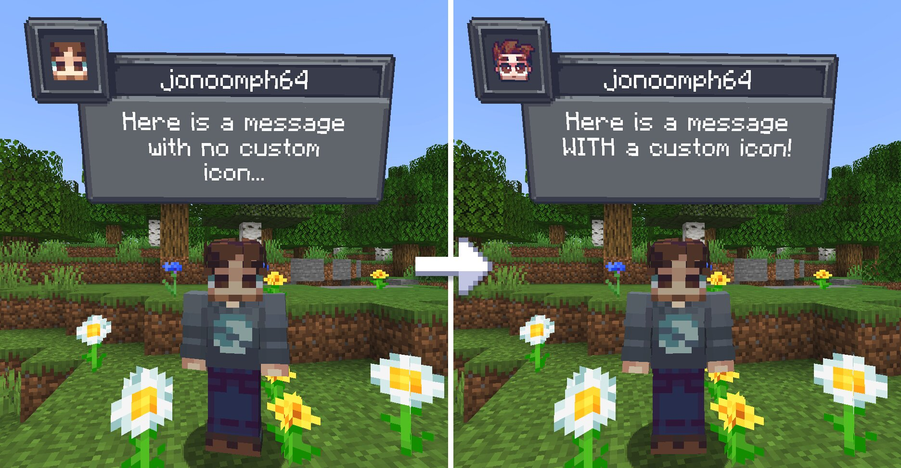
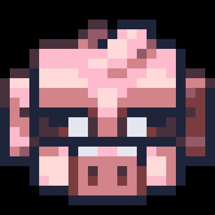
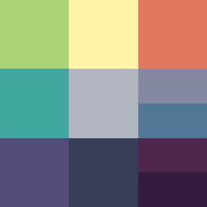
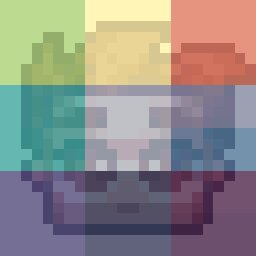
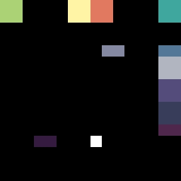
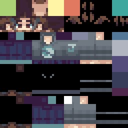
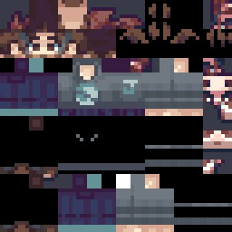
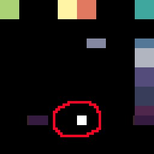
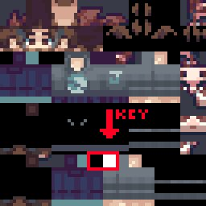

# Icon Tutorial for CreatureChat™



### Customize entity and player icons in **CreatureChat™** by following this step-by-step guide.

---

## **Custom Entity Icons**


### Folder Structure:
To add custom icons for entities, place the icon files in the following path:
```
src/main/resources/assets/creaturechat/textures/entity/pig/pig.png
src/main/resources/assets/creaturechat/textures/entity/cat/black.png
src/main/resources/assets/creaturechat/textures/entity/alligator.png
src/main/resources/assets/creaturechat/textures/entity/YOUR-ENTITY.png
...
```

- Entity icons should be `32x32` pixels, and PNG format.
- The icon file path should match the **renderer texture path** of the entity.
- This supports all entities, including those from other mods.

These are source-tree paths. In a resource pack, use `assets/creaturechat/textures/entity/...` relative to the pack root, with the same renderer texture path. Rebuild the mod only when changing its bundled resources.

---

## **Custom Player Icons**

### Step 1: Draw your character on top of the rainbow template
Player icons should be `24x24` pixels, and PNG format.
- Open the [rainbow layout reference (JPEG)](src/main/resources/assets/creaturechat/screenshots/rainbow-icon-template.jpeg). This screenshot is a guide; create the final icon as a PNG so its pixels remain exact.


&nbsp; 
&nbsp; 


### Step 2: Position your icon on your skin
- Open the [skin layout reference (JPEG)](src/main/resources/assets/creaturechat/screenshots/skin-template.jpeg). Save the final Minecraft skin as a 64×64 PNG.


&nbsp; 
&nbsp; 

### Step 3: Toggle Icon Visibility
To activate a custom player icon, include a **black and white key** in your skin:


&nbsp; 
&nbsp; 

1. Ensure pixel `(31, 48)` is opaque black (`#000000`). A black block beginning at `(28, 48)` must include this pixel.
2. Ensure pixel `(32, 48)` is opaque white (`#FFFFFF`).

Coordinates are zero-based. CreatureChat™ checks these two exact pixels; JPEG compression or transparency can prevent detection. It then assembles the icon from the UV regions below.

### Step 4: Upload Skin in the Minecraft Launcher

- Don't forget to upload your new skin which includes the icon.
- Test your changes in-game by talking to a mob (in F5 mode)

## UV Coordinates for Icon:
Here are the full list of coordinates for the custom player icon UV.

```
UV_COORDINATES = [
    [0.0, 0.0, 8.0, 8.0, 0.0, 0.0],     # row 1 left
    [24.0, 0.0, 32.0, 8.0, 8.0, 0.0],   # row 1 middle
    [32.0, 0.0, 40.0, 8.0, 16.0, 0.0],  # row 1 right

    [56.0, 0.0, 64.0, 8.0, 0.0, 8.0],      # row 2 left
    [56.0, 20.0, 64.0, 28.0, 8.0, 8.0],    # row 2 middle
    [36.0, 16.0, 44.0, 20.0, 16.0, 8.0],   # row 2 top right
    [56.0, 16.0, 64.0, 20.0, 16.0, 12.0],  # row 2 bottom right

    [56.0, 28.0, 64.0, 36.0, 0.0, 16.0],   # row 3 left
    [56.0, 36.0, 64.0, 44.0, 8.0, 16.0],   # row 3 middle
    [56.0, 44.0, 64.0, 48.0, 16.0, 16.0],  # row 3 top right
    [12.0, 48.0, 20.0, 52.0, 16.0, 20.0],  # row 3 bottom right
]
```

---

## Enjoy customizing your CreatureChat™ experience! 😊

