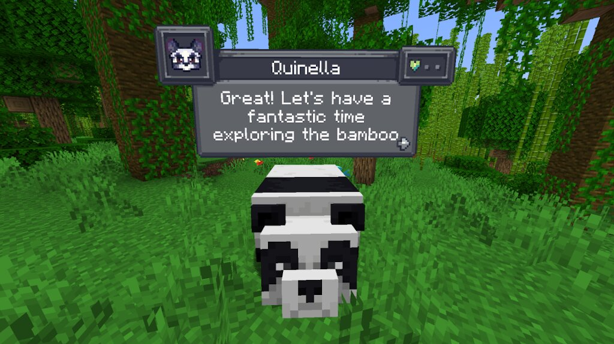

# CreatureChat(TM) - MobChat Fork

Chat with any mob in Minecraft. Creatures can speak, remember players, react to events, and execute AI-driven behaviors through a configured LLM provider.

## Fork Notice

This repository contains the MobChat fork of CreatureChat: <https://github.com/Le-Who/MobChat>. It started from CreatureChat, but this codebase has diverged and should be treated as its own project. Build, install, configure, and support this fork from the MobChat repository and local server configuration, not from upstream CreatureChat services.

## Features

- **AI-driven mob conversations:** Each mob can generate contextual chat through an OpenAI-compatible LLM endpoint.
- **Structured AI output:** Chat and character generation use strict JSON schemas to reduce malformed replies and keep behavior parsing predictable.
- **Mob behavior actions:** Creatures can follow, flee, attack, protect, wait, return home, guard home, and react through the behavior system.
- **Character sheets:** New mobs can receive generated names, personalities, classes, skills, likes, dislikes, alignment, background, and greeting text.
- **Memory and relationships:** Mobs remember player interactions, social events, friendship changes, harmful actions, and recent context.
- **Automatic reactions:** Mobs can react to damage, item showing/giving/taking, arrivals, proximity chat, and mob-to-mob chat.
- **Cost controls:** Automatic responses have cooldowns and Gemini usage is preflight-limited before HTTP requests to avoid avoidable rate-limit freezes.
- **Inventories and loot:** Every mob has an inventory backed by generated per-biome loot tables.
- **Multiplayer sync:** Chat bubbles, messages, inventory UI, and entity chat state are synchronized for server players.
- **Advancements:** Players can unlock CreatureChat milestones as relationships develop.


## Supported Runtime

- Default Minecraft target: read `minecraft_version` in `gradle.properties`
- Loader: Fabric Loader with Fabric API
- Java source/target compatibility: Java 17
- Gradle toolchain configured locally in `gradle.properties`
- Version-specific source overrides live under `src/vs/` and are applied by the Gradle build when a newer Minecraft target needs patched source files.

## Build

From the repository root:

```powershell
.\gradlew.bat build
```

The remapped release jar is written to:

```text
build/libs/creaturechat-<mod-version>+<minecraft-version>.jar
```

The build also writes the stable install jar and release hash file:

```text
build/libs/creaturechat.jar
build/libs/creaturechat-<mod-version>+<minecraft-version>.jar.sha512
```

Use `creaturechat.jar` in `mods/`. Upload the versioned jar and matching `.sha512` file to GitHub Releases.

For targeted checks:

```powershell
.\gradlew.bat test
.\gradlew.bat test --tests com.lewho.tests.ChatGPTRequestUsageLimitTests
```

## Installation

### Fabric

1. Install Fabric Loader and Fabric API for the target Minecraft version.
2. Build this fork locally.
3. Copy `creaturechat.jar` and the matching `fabric-api-*.jar` into `.minecraft/mods`.
4. Launch Minecraft with the Fabric profile.
5. Configure an LLM provider in-game with `/creaturechat setup`.

### Forge With Sinytra Connector

Sinytra Connector support is only expected for Minecraft `1.20.1`.

1. Install Forge.
2. Install Forgified Fabric API.
3. Install Sinytra Connector.
4. Build this fork locally and copy `creaturechat.jar` into `.minecraft/mods`.
5. Launch Minecraft with the Forge profile.
6. Configure an LLM provider with `/creaturechat setup`.

## Auto Update

CreatureChat can check GitHub Releases for a newer jar, download it, verify its `.sha512` file, and stage it for replacement without manual file copying. The running JVM is not hot-reloaded: the new jar becomes active only after Minecraft or the dedicated server is restarted.

Release assets must include both files for each supported Minecraft target:

```text
creaturechat-<mod-version>+<minecraft-version>.jar
creaturechat-<mod-version>+<minecraft-version>.jar.sha512
```

Server OP commands:

```text
/creaturechat update check
/creaturechat update download
/creaturechat update status
/creaturechat update apply
```

`download` stages the jar under `.creaturechat-updates/` and starts a small helper process. The helper waits for the current JVM to exit, moves the old jar from `mods/` to a backup folder, and places the verified new jar at `mods/creaturechat.jar`. It does not stop or restart the server; the admin decides when to restart. If a helper process was not started or was killed by the host panel, use `/creaturechat update apply` before stopping the server.

On clients, CreatureChat checks once shortly after the Minecraft main menu starts, and can also show the prompt while idle in-game. When a newer compatible release is found, it shows a consent screen. The jar is downloaded only after the player clicks `Download`, then the helper installs it after Minecraft exits.

## AI Provider Setup

CreatureChat requires an LLM for generated character sheets and chat replies. The mod sends OpenAI-compatible chat completions requests, so providers should expose an OpenAI-compatible endpoint.

Recommended setup path:

```text
/creaturechat setup
```

The setup screen is OP-only. It saves values to the server world's `creaturechat.json` and does not send stored API keys back to the client.

Provider presets currently include:

- `openai`
- `ai-studio` — Google AI Studio via the **native Gemini API** (`generateContent`)
- `openrouter`
- `groq`
- `ollama`
- `litellm`

Console/script fallback:

```text
/creaturechat setup provider ai-studio
/creaturechat setup key <key1,key2>
/creaturechat setup model gemini-3.5-flash-lite
/creaturechat setup outputtokens 1024
/creaturechat setup test
/creaturechat setup show
```

You can enter multiple comma-separated API keys or models. The request layer rotates candidates when local quota checks or provider errors make the active candidate unavailable.

## Google AI Studio / Gemini Notes

The `ai-studio` preset uses the **native Gemini `generateContent` API**, not the OpenAI-compatibility layer. The endpoint base URL is:

```text
https://generativelanguage.googleapis.com/v1beta
```

Requests that target `generativelanguage.googleapis.com` without the `/openai` path segment are automatically routed to the native Gemini client. Character generation and chat use `generation_config.response_schema` with `responseMimeType: application/json` for structured output.

Default model:

```text
gemini-3.5-flash-lite
```

This fork preflights Gemini usage before sending HTTP requests:

- Default minute limit: `14 RPM`
- Default daily limit: `450 RPD`
- Default scope: `per_key`
- Daily usage state file: `creaturechat_usage.json`

Commands:

```text
/creaturechat setup geminirpm 14
/creaturechat setup geminidaily 450
/creaturechat setup geminiscope per_key
```

Use `geminiscope shared` if several configured keys belong to the same Google project and should share one local quota bucket. The usage file stores hashed key buckets and daily counts; it is runtime state and is ignored by Git.

Google AI Studio also enforces its own account and public-network location eligibility. If `/creaturechat setup test` reports that AI Studio is unavailable from the current network location, changing the API key, model, output-token limit, or thinking level will not resolve it. Use a network and Google account supported by AI Studio, or select another provider preset. See Google's [available-region requirements](https://ai.google.dev/gemini-api/docs/available-regions).

## Output Tokens And Thinking

`maxOutputTokens` limits the generated response budget, not the input context. The default is `1024`. Structured JSON modes raise the effective floor when needed so character/chat JSON is less likely to be truncated.

Gemini thinking level is configurable through the setup screen. The AI Studio preset defaults to `minimal`.

### Generation Language

By default the mob AI uses each player's Minecraft client locale for name generation and chat replies. To lock a single language server-wide:

```text
/creaturechat setup language ru_ru
/creaturechat setup language en_us
/creaturechat setup language auto    # restore per-player behaviour (default)
```

The GUI setup screen also exposes a **Generation language** button that opens a scrollable picker with all official Minecraft locales. The locale code (e.g. `ru_ru`) is stored in `creaturechat.json`; the mod converts it to the in-language display name (e.g. `Русский (Россия)`) before embedding it in the LLM prompt.

## Gameplay Tuning

Useful runtime knobs:

```text
/creaturechat setup damagecooldown 25
/creaturechat outputtokens set <tokens>
/creaturechat timeout set <seconds>
/creaturechat model set <model1,model2>
/creaturechat url set "<url>"
```

Damage-triggered AI replies have their own cooldown. Suppressed hits are summarized into the next allowed damage reaction so long fights do not generate a request for every hit.

## Player Chat Controls

Players can choose whether NPC replies to other players are shown in their own CreatureChat bubble sync and normal chat feed:

```text
/creaturechat overhear on
/creaturechat overhear off
/creaturechat overhear status
```

The preference is saved per player in the server world's `creaturechat_player_prefs.json`. Your own NPC conversations remain visible even when overhearing is off. If `/creaturechat send_to_chat` is enabled, NPC replies are sent to the normal chat only for players allowed by this preference.

When you open the mob chat input screen, it now requests and shows the recent message history for that mob. The full history is not sent during login; clients request only the selected mob's recent entries.

## Entity Visibility

```text
/creaturechat whitelist <entityType|all|clear>
/creaturechat blacklist <entityType|all|clear>
```

Whitelist and blacklist commands control which entity types show CreatureChat bubbles.

## Story Prompt

```text
/story set "<story-text>"
/story display
/story clear
```

The story text is included in character creation and chat prompts.

## Configuration Scope

Most setup commands accept an optional config scope:

- `--config server`: save to the current server world's `creaturechat.json`
- `--config default`: save to the default root config

If omitted, legacy commands use the default scope unless the `/creaturechat setup ...` subcommand explicitly saves to the server config.

## Development References

- [Build Instructions](INSTALL.md)
- [Contribution Guide](CONTRIBUTING.md)
- [Player & Entity Icon Tutorial](ICONS.md)
- [Privacy](PRIVACY.md)
- [Terms](TERMS.md)

## Screenshots




## Authors

- MobChat fork maintainers
- Original CreatureChat authors are retained in source headers and license metadata where applicable.

## License

- [](https://reuse.software)
- Source code: [GNU GPL v3](LICENSE.md)
- Non-code assets: [CC-BY-NC-SA-4.0](LICENSE-ASSETS.md)

## Legal Notices

- Review [Terms](TERMS.md) and [Privacy](PRIVACY.md) before operating any public server or remote AI service with this fork.
- CreatureChat(TM) is an independent project and is not endorsed by Mojang AB, Microsoft Corp., OpenAI, Google, or any LLM provider.
- Minecraft(R) is a trademark of Mojang AB. ChatGPT(R) is a trademark of OpenAI OpCo, LLC. All trademarks appear here for identification only.
- CreatureChat(TM) is a trademark of lewho LLC (registration pending). Factual nominative references such as "Fork of CreatureChat" that do not imply endorsement are allowed; all other uses of the name or logo require prior permission.
